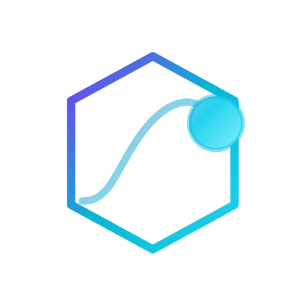

<p align="center">
  
</p>

<h1 align="center">Boing Network</h1>

<p align="center">
  <strong>Authentic, decentralized L1 blockchain — built from first principles.</strong><br />
  The DeFi that always bounces back.
</p>

<p align="center">
  <a href="https://boing.network">Website</a> ·
  <a href="https://boing.observer">Explorer</a> ·
  <a href="https://boing.express">Wallet</a> ·
  <a href="https://boing.finance">DeFi</a> ·
  <a href="https://boing.network/docs">Docs</a> ·
  <a href="https://discord.gg/boing">Discord</a>
</p>

---

Boing is an independent Layer 1: Rust node, BLAKE3 + Ed25519, PoS + HotStuff BFT, and a native **Boing VM** (not EVM bytecode). Quality assurance is enforced at the protocol layer — only deployments that meet the network's rules land on-chain.

## Official repositories

| Repository | Live site | Role |
|---|---|---|
| **[boing.network](https://github.com/Boing-Network/boing.network)** | [boing.network](https://boing.network) | Protocol, `boing-node`, TypeScript SDK, website, and operator docs |
| **[boing.observer](https://github.com/Boing-Network/boing.observer)** | [boing.observer](https://boing.observer) | Block explorer — blocks, accounts, DEX directory, QA tools |
| **[boing.express](https://github.com/Boing-Network/boing.express)** | [boing.express](https://boing.express) | Non-custodial wallet — web app and browser extension |
| **[boing.finance](https://github.com/Boing-Network/boing.finance)** | [boing.finance](https://boing.finance) | Cross-chain DeFi — native L1 AMM plus EVM and Solana surfaces |

These four repositories are the official product surface. This `.github` repository holds the organization profile and default community files; it is not a product codebase.

## Start here

| You want to… | Go here |
|---|---|
| Run a node or join testnet | [boing.network](https://github.com/Boing-Network/boing.network) · [TESTNET.md](https://github.com/Boing-Network/boing.network/blob/main/docs/TESTNET.md) · [Join testnet](https://boing.network/testnet/join) |
| Browse the chain | [boing.observer](https://boing.observer) |
| Hold, send, or stake BOING | [boing.express](https://boing.express) |
| Swap or deploy on L1 / EVM / Solana | [boing.finance](https://boing.finance) |
| Build a dApp against public RPC | [BOING-DAPP-INTEGRATION.md](https://github.com/Boing-Network/boing.network/blob/main/docs/BOING-DAPP-INTEGRATION.md) · [RPC-API-SPEC.md](https://github.com/Boing-Network/boing.network/blob/main/docs/RPC-API-SPEC.md) |
| Align wallet, explorer, and partner apps | [THREE-CODEBASE-ALIGNMENT.md](https://github.com/Boing-Network/boing.network/blob/main/docs/THREE-CODEBASE-ALIGNMENT.md) |

Public testnet RPC: `https://testnet-rpc.boing.network`

```bash
git clone https://github.com/Boing-Network/boing.network.git
cd boing.network
cargo build
cargo run -p boing-node
```

## Six pillars

Security → Scalability → Decentralization → Authenticity → Transparency → **True quality assurance**

Protocol-enforced QA is a first-class rule: automation plus a community pool for genuine edge cases, leniency for meme culture, and no malice on-chain. Overview: [BOING-NETWORK-ESSENTIALS.md](https://github.com/Boing-Network/boing.network/blob/main/docs/BOING-NETWORK-ESSENTIALS.md).

## Contribute & disclose

- **Contributing:** [CONTRIBUTING.md](https://github.com/Boing-Network/.github/blob/main/CONTRIBUTING.md)
- **Code of conduct:** [CODE_OF_CONDUCT.md](https://github.com/Boing-Network/.github/blob/main/CODE_OF_CONDUCT.md)
- **Security:** report privately via [GitHub Security Advisories](https://github.com/Boing-Network/boing.network/security/advisories/new) — see [SECURITY.md](https://github.com/Boing-Network/.github/blob/main/SECURITY.md)
- **Support:** [SUPPORT.md](https://github.com/Boing-Network/.github/blob/main/SUPPORT.md)
- **Discussions:** [Boing-Network/.github discussions](https://github.com/Boing-Network/.github/discussions)

*Authentic. Decentralized. Optimal. Sustainable.*
